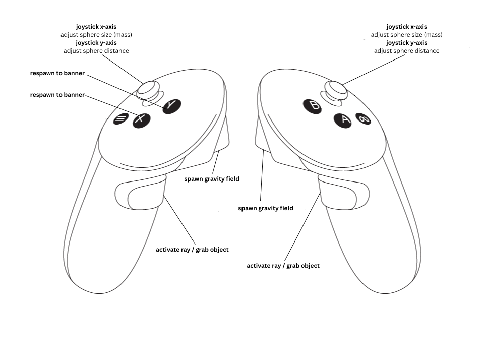
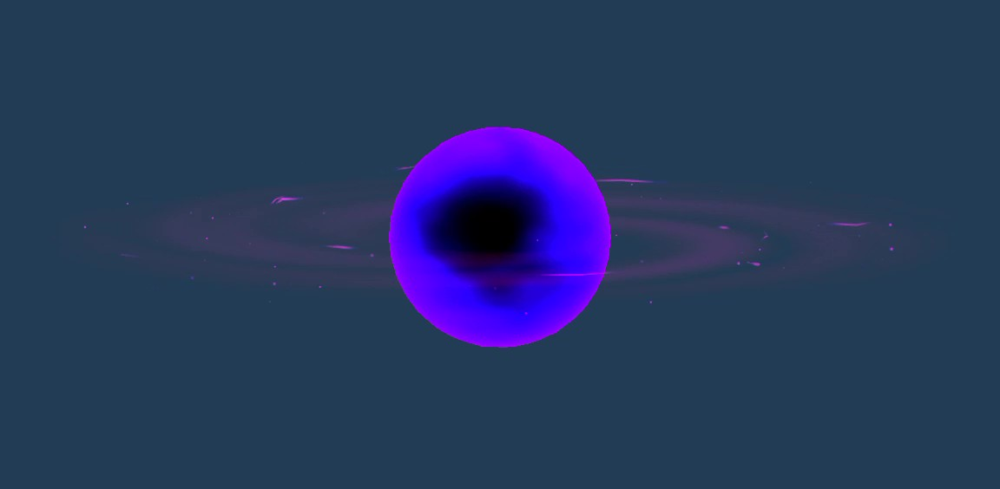
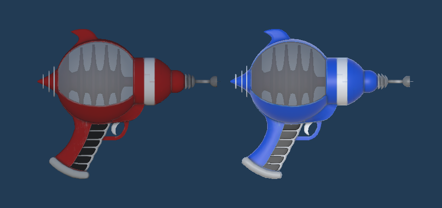
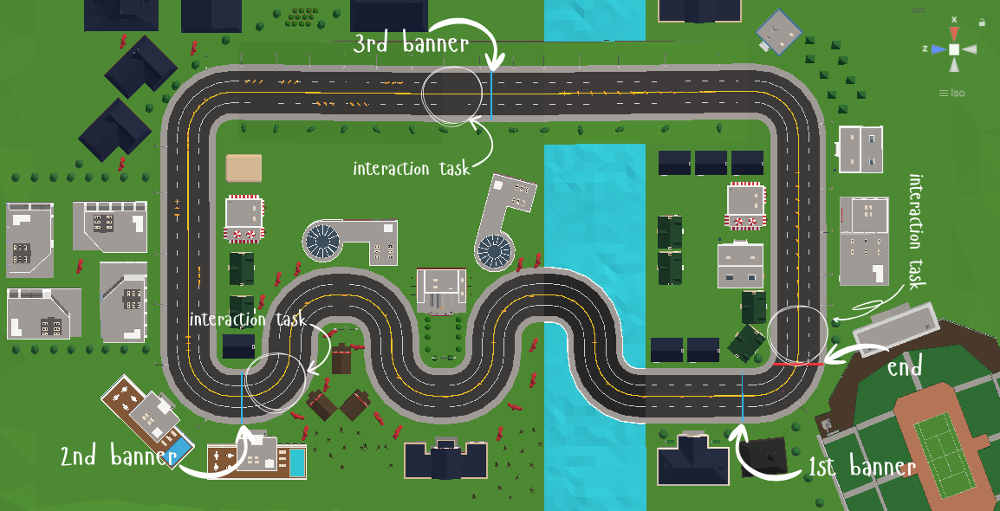

+++
date = '2026-03-14T18:09:45+01:00'
draft = false
title = 'The Toolkit - Manual, Prefabs, and Controls'
topics = ['implementation']
+++

## Controller Mapping

## The Prefabs

### The Spheres
The final version of the spheres looks a bit different from the ones I used for most of development.

When I built the project for the Meta Quest, I had to optimize the spheres to run smoothly on the device. The visual effect I had originally chosen completely overwhelmed the Quest's GPU, leading to a framerate of about zero (seriously, it was that bad).

To fix this, I had to switch to something more performance-friendly. Luckily, I found [this](https://assetstore.unity.com/packages/vfx/black-hole-effect-356686) black hole effect on the Unity Asset Store, which was perfect for my needs. I simply changed the colors to match my theme. The result was a significant improvement in performance while still maintaining a visually interesting design for the spheres.

### The Ray Guns
To implement the first variation of the sphere spawner, I was looking through YouTube tutorials and came across [this](https://www.youtube.com/watch?v=CcJ4yMTzXUM&t=1515s) video. While I didn’t end up using his code, I later remembered it when I decided to go for the gun metaphor in the final version. In the video, he referenced a free [gun model](https://sketchfab.com/3d-models/50s-style-ray-gun-42b7288de197481292cc0f511f84a0dc) on Sketchfab, which I downloaded and used for my ray guns. The model came in red, so I had to do some very professional Photoshopping to create a blue material for the right hand, which is why the blue gun looks a bit worse than the red one.

## Environment: Parkour Course
In our class, we were provided with the environment shown in the image below.

The parkour course has three sections: a straight winding path, a zig-zag path with an uphill slope, and a final sprint that first goes downhill and then curves into a jump. The course is designed to test the player's ability to navigate different types of terrain and obstacles.

In each section, players can also collect coins, which are quite challenging to get with the gravity spheres, as they require precise control and timing to reach. The coins serve as an additional challenge and incentive for players to master the locomotion system. I must admit that during my practice runs, I often gave up on collecting them and instead tried to clear each section as quickly as possible.

The interaction task is at the end of each section.

Next post: [The Final Experience - Demo and User Study]()
